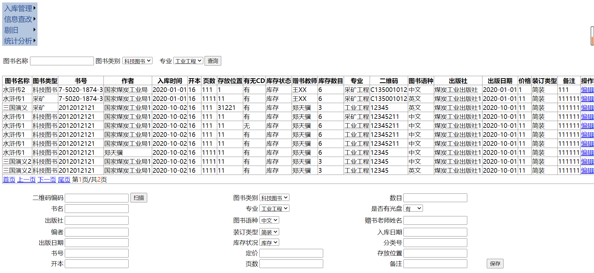
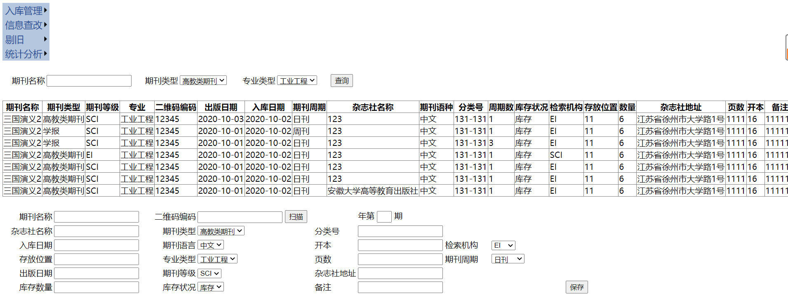
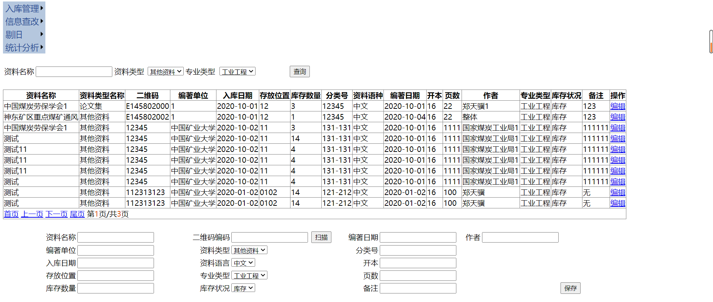
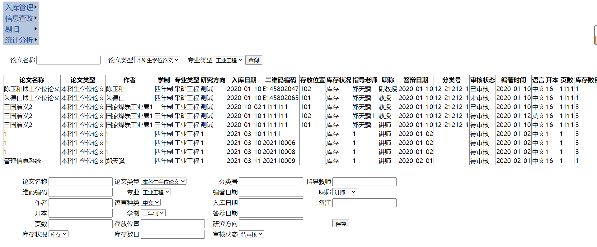

# Z大学二级学院档案管理系统的开发研究

## 1登录功能

登录、登出系统等功能，用户需要登录后才可以使用系统

输入账号和密码点击登录进入系统

如果密码错误则弹出提示框

并重新输入

## 2后台首页

导航菜单

## 3入库管理

### 3.1图书入库

管理员手工录入图书信息

录入信息包括：

图书名称、图书类别（由管理员设置）、专业（由管理员设置）、二维码编码（扫描录入）、出版社、出版日期、编者、入库日期、赠书教师姓名、库存数量、有无光盘、存放位置、装订类型（由管理员设置）、库存状态、书号、开本、页数、定价、备注

点击保存提交

数据库会将该条记录插入book表

### 3.2期刊入库

管理员手工录入期刊信息

录入信息包括：

期刊名称、期刊类别（由管理员设置）、出版周期（由管理员设置）、期数、二维码编码、杂志社名称、出版日期、出版社地址、分类号、入库日期、期刊语种（由管理员设置）、期刊等级（由管理员设置）、检索机构（由管理员设置）、备注

点击保存提交

数据库会将该条记录插入journal表

###  3.3资料入库

管理员手工录入期刊信息

录入信息包括：

资料类别（由管理员设置）、资料名称、二维码编码、编著单位、入库时间、编著时间、开本、页数、编者、专业（由管理员设置）、存放位置、分类号、资料语种（由管理员设置）、备注

点击保存提交

数据库会将该条记录插入data表

### 3.4论文入库

#### 3.4.1论文上传

用户在线提交论文

提交信息包括：

作者、论文类别、论文名称、指导教师（可多个）、教师职称、学制、专业、研究方向、答辩日期、开本、页数、论文语言

附件（论文电子版）

点击保存提交

后端自动生成二维码并返回给用户

数据库将该条记录插入paper表，审核状态初始化为待审核

#### 3.4.2论文审核

管理员进入论文审核界面，通过扫描枪扫描二维码，关于该论文的所有信息将会显示在界面，管理员核对无误后，完善论文信息，点击审核按钮完成审核。

随后将论文审核状态置为已审核

## 4剔旧

从数据库删除需要剔旧的图书的信息

## 5统计

### 5.1图书信息统计

图书总册数

各类别的图书数目

各专业的图书数目

### 5.2期刊信息统计

期刊总册数

各期刊类别数目

各专业数目

### 5.3资料信息统计

资料总册数

各类别的资料数目

各专业的资料数目

### 5.4论文信息统计

论文总册数

类别的论文数目

各专业的论文数目

## 6信息查改

### 6.1入库图书信息查询修改

查询条件有图书名称、图书类别、专业

通过点击编辑来修改该条记录，选中的记录会在下面详细显示

### 6.2入库期刊信息查询修改

### 6.3入库资料信息查询修改

### 6.4入库论文信息查询修改

